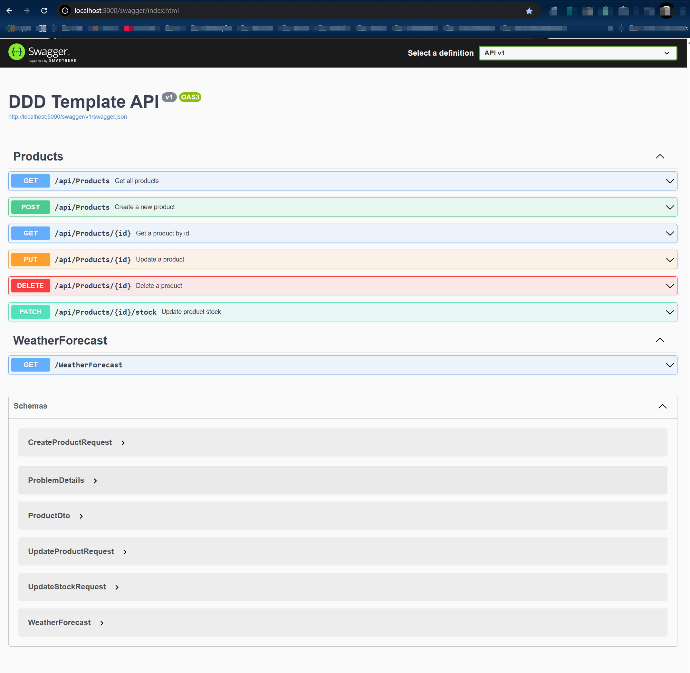

<h1 align="center">
    
</h1>

<h1 align="center">
   🙂 <a href="#"> API .NET </a>
</h1>

<h3 align="center">
    .NET API Template with DDD Architecture
</h3>

<h4 align="center">
  <!-- Status: development -->
    Status: Finished
</h4>

<p align="center">
 <a href="#about">About</a> •
 <a href="#features">Features</a> •
 <a href="#layout">Technologies</a> •
 <a href="#how-it-works">Project Structure</a> •
 <a href="#project-structure">Project Structure</a> •
 <a href="#contributors">Getting Started</a> •
<a href="#contributors">Documentation</a> •
<a href="#contributors">Testing</a> •<a href="#contributors">Configuration</a> •<a href="#contributors">License</a> •
 <a href="#author">Author</a> •

</p>

## About

A modern, clean, and scalable .NET API template following Domain-Driven Design (DDD) principles and Clean Architecture.

## 🚀 Features

### Architecture

- [x] Clean Architecture implementation
- [x] Domain-Driven Design (DDD) principles
- [x] SOLID principles
- [x] CQRS pattern support
- [x] Repository pattern implementation

### Project Structure

- [x] **Domain Layer**: Core business logic and entities
- [x] **Application Layer**: Application services and use cases
- [x] **Infrastructure Layer**: External services, database access, and implementations
- [x] **API Layer**: REST API endpoints and controllers

### Technical Features

- [x] .NET 9.0
- [x] Swagger/OpenAPI documentation
- [x] Built-in API versioning
- [x] Global error handling
- [x] Request/Response logging
- [x] Dependency Injection
- [x] Async/await patterns
- [x] Nullable reference types enabled
- [x] XML documentation support

### Development Features

- [x] Unit testing setup
- [x] Integration testing support
- [x] Debug configuration for VS Code
- [x] EditorConfig for consistent coding style
- [x] Solution-wide code organization

## 🛠️ Technologies

### Core Technologies

- **.NET 9.0**: Latest version of .NET framework
- **C#**: Modern C# features and syntax
- **ASP.NET Core**: Web API framework

### Documentation & API

- **Swagger/OpenAPI**: API documentation and testing
- **Microsoft.AspNetCore.OpenApi**: OpenAPI specification support

### Testing

- **xUnit**: Unit testing framework
- **Moq**: Mocking framework for unit tests

### Development Tools

- **Visual Studio Code**: Development environment
- **.NET CLI**: Command-line tools
- **Git**: Version control

## 📁 Project Structure

```
├── src/
│   ├── API/                 # API Layer - Controllers and API configurations
│   ├── Application/         # Application Layer - Use cases and interfaces
│   ├── Domain/             # Domain Layer - Entities and business rules
│   └── Infrastructure/     # Infrastructure Layer - External services and implementations
├── tests/
│   ├── Domain.UnitTests/   # Unit tests for Domain layer
│   └── Application.UnitTests/ # Unit tests for Application layer
└── .vscode/               # VS Code configuration files
```

## 🚀 Getting Started

### Prerequisites

- .NET 9.0 SDK
- Visual Studio Code or Visual Studio 2022
- Git

### Running the Project

1. Clone the repository

```bash
git clone [repository-url]
```

2. Navigate to the project directory

```bash
cd template-dot-net-api
```

3. Restore dependencies

```bash
dotnet restore
```

4. Build the solution

```bash
dotnet build
```

5. Run the API

```bash
dotnet run --project src/API
```

### Debugging

The project includes VS Code launch configurations for debugging:

- Press F5 to start debugging
- Use breakpoints to inspect variables
- Use the Debug toolbar for step-by-step execution

## 📚 Documentation

API documentation is available through Swagger UI when running the application:

- Navigate to `/swagger` endpoint
- Interactive API documentation
- Request/Response examples
- API testing interface

## 🧪 Testing

### Running Tests

```bash
dotnet test
```

### Test Coverage

- Unit tests for Domain layer
- Unit tests for Application layer
- Integration test support

## 🔧 Configuration

The project uses the following configuration files:

- `appsettings.json`: Application settings
- `appsettings.Development.json`: Development-specific settings
- `.editorconfig`: Code style and formatting rules

## 🔄 Migrações do Banco de Dados

### Criar Nova Migração

```bash
dotnet ef migrations add NomeDaMigracao --project src/Infrastructure --startup-project src/API
```

### Aplicar Migrações

```bash
dotnet ef database update --project src/Infrastructure --startup-project src/API
```

### Remover Última Migração

```bash
dotnet ef migrations remove --project src/Infrastructure --startup-project src/API
```

## 🛠️ Desenvolvimento

### Adicionar Nova Entidade

1. Criar classe da entidade em `src/Domain/Entities`
2. Adicionar DbSet no `ApplicationDbContext`
3. Configurar mapeamento no `OnModelCreating`
4. Criar e aplicar migração

### Adicionar Novo Repositório

1. Criar interface em `src/Domain/Repositories`
2. Implementar em `src/Infrastructure/Repositories`
3. Registrar no container de DI

## 📝 Notas

- O certificado HTTPS é apenas para desenvolvimento
- Em produção, use certificados válidos
- As credenciais do banco de dados são apenas para desenvolvimento
- Em produção, use variáveis de ambiente ou secrets para credenciais

## 🔧 Configuração do Ambiente Local

### 1. Configuração do Banco de Dados

```bash
# Acessar o PostgreSQL
sudo -u postgres psql

# Criar banco de dados e usuário
CREATE DATABASE dddtemplate;
CREATE USER postgres WITH PASSWORD 'postgres';
GRANT ALL PRIVILEGES ON DATABASE dddtemplate TO postgres;
\q
```

### 2. Instalação das Ferramentas do EF Core

```bash
# Instalar a ferramenta do EF Core globalmente
dotnet tool install --global dotnet-ef

# Adicionar ao PATH (Linux/MacOS)
export PATH="$PATH:$HOME/.dotnet/tools"
echo 'export PATH="$PATH:$HOME/.dotnet/tools"' >> ~/.bashrc
source ~/.bashrc
```

### 3. Configuração do Certificado HTTPS

```bash
# Criar diretório para certificados
mkdir -p certificates

# Gerar certificado de desenvolvimento
dotnet dev-certs https -ep ./certificates/aspnetapp.pfx -p YourSecurePassword123!
dotnet dev-certs https --trust
```

## 🏃‍♂️ Executando Localmente

### 1. Restaurar Dependências

```bash
dotnet restore
```

### 2. Aplicar Migrações do Banco de Dados

```bash
# Criar migração inicial (se necessário)
dotnet ef migrations add InitialCreate --project src/Infrastructure --startup-project src/API

# Aplicar migrações
dotnet ef database update --project src/Infrastructure --startup-project src/API
```

### 3. Executar a Aplicação

```bash
cd src/API
dotnet run
```

A API estará disponível em:

- HTTP: <http://localhost:5254>
- HTTPS: <https://localhost:7186>
- Swagger: <https://localhost:7186/swagger>

## 🐳 Executando com Docker

### 1. Construir e Executar os Containers

```bash
# Construir e iniciar todos os serviços
docker-compose up --build

# Ou em modo detached
docker-compose up -d --build
```

Os serviços estarão disponíveis em:

- API:
  - HTTP: <http://localhost:5254>
  - HTTPS: <https://localhost:7186>
- PostgreSQL: localhost:5432
- Redis: localhost:6379

### 2. Parar os Containers

```bash
docker-compose down
```

## License

This project is licensed under the MIT License - see the LICENSE file for details.

## How to contribute

1. Fork the project.
2. Create a new branch with your changes: `git checkout -b my-feature`
3. Save your changes and create a commit message telling you what you did: `git commit -m" feature: My new feature "`
4. Submit your changes: `git push origin my-feature`
   > If you have any questions check this [guide on how to contribute](./CONTRIBUTING.md)

---

## Author

<a href="https://github.com/jhonatheberson">
 
 <br />
 <sub><b>Jhonat Heberson</b></sub></a> <a href="https://github.com/jhonatheberson" title="Github"></a>
 <br />

[](https://www.linkedin.com/in/jhonat-heberson-64816616a/)
[](mailto:jhonatheberson@gmail.com)
